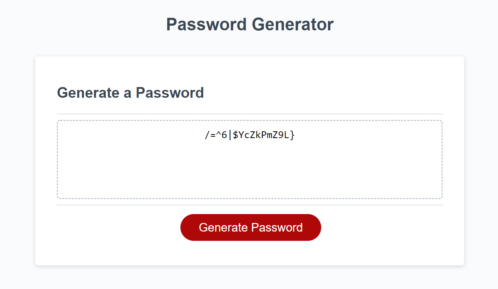

# Password Generator
The random password generator promts the user for the password length (8-128) and the strength of the password (lower case, upper case, numerical, special characters), then displays the generated password on the screen. The program ensures the user enters at least one set of characters in order to generate the password. The program ensures the password is random and contains at least one character of the selected character sets in order to fulfill the password complexity requirements for any real password field.

**Author:** Melinda Ivanov

## Links
- https://github.com/jnsmelinda/Password-generator
- https://jnsmelinda.github.io/Password-generator

## Technologies
- [JavaScript](https://www.javascript.com)
- [HTML5](https://en.wikipedia.org/wiki/HTML5)
- [CSS3](https://en.wikipedia.org/wiki/Cascading_Style_Sheets)
- [Git](https://git-scm.com/), [GitHub](https://github.com)
- [Github Pages](https://pages.github.com)

## Steps of developement
- adding project skeleton files
- create .editorconfig
- creating default character sets
- implementing the function to prompt for length of the password
- implementing the function to prompt for strength of the password
- implementing the function to generate a random password
- implementing the function to validate and regenerate (if needed) the password
- adding demo image
- refactor/clean-up
- readme

## Others
Original files and desing are from the [University of Washington coding bootcamp](https://bootcamp.uw.edu).

© 2020 Melinda Ivanov
